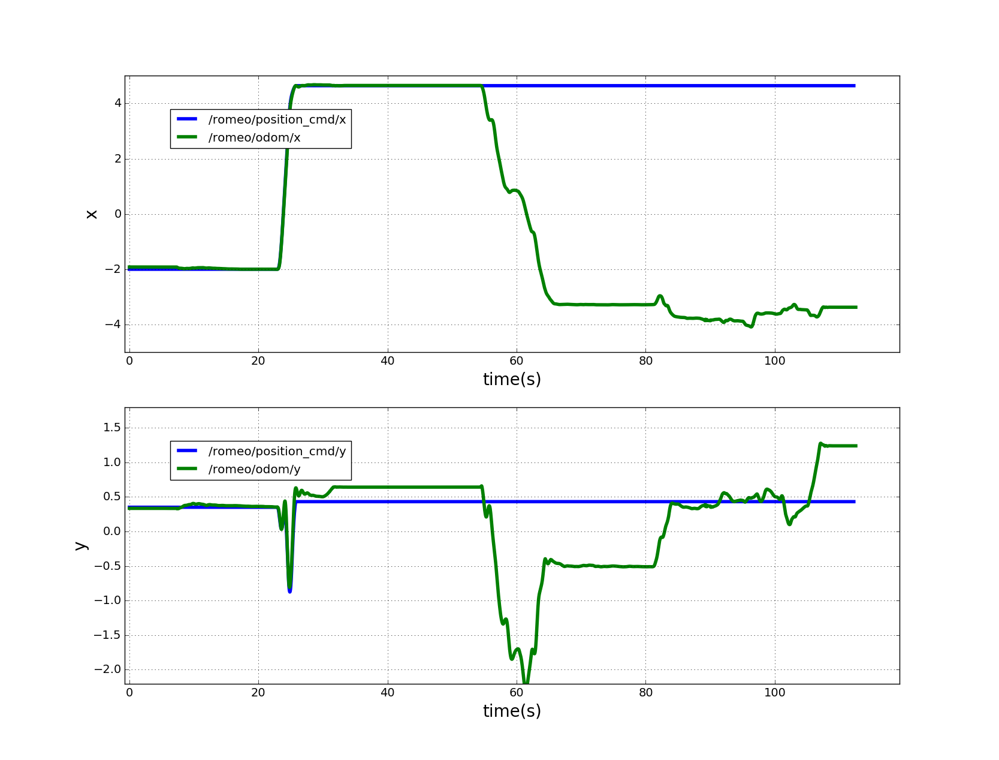

Bag Plot
==========
A python script for plotting ros bag file, replacement of [rxbag](http://wiki.ros.org/rxbag) for ros version higher than groovy

Basic use instruction:
--------------------
On terminal:
```
$rosrun bag_plot read_bag.py /path/to/bag/xxx.bag
```
On GUI:
* Check topics to select corresponding msg
* Check variables to select values to plot
* Click `Load` to plot, the first time for load will take a while
* Click `Clear` to reset figure params
* Click `Save Figure` to save current plot as `plot.png` in the current folder

Examples:
------------------
 


Basic feature list:
------------------
* Right click on plot to draw a vertical line
* Drag any subplot in x to move all subplots in x dimension
* Drag any subplot in y to move that subplot in y dimension
* Scroll up/down to scale in x dimension
* Shift + Scroll up/down to scale in y dimension

Msgs supported:
------------------
* nav\_msgs/Odometry
* sensor\_msgs/Imu
* geometry\_msgs/PoseStamped
* geometry\_msgs/PoseWithCovarianceStamped
* sensor\_msgs/Range
* quadrotor\_msgs/PositionCommand
* quadrotor\_msgs/TRPYCommand
* quadrotor\_msgs/SO3Command
